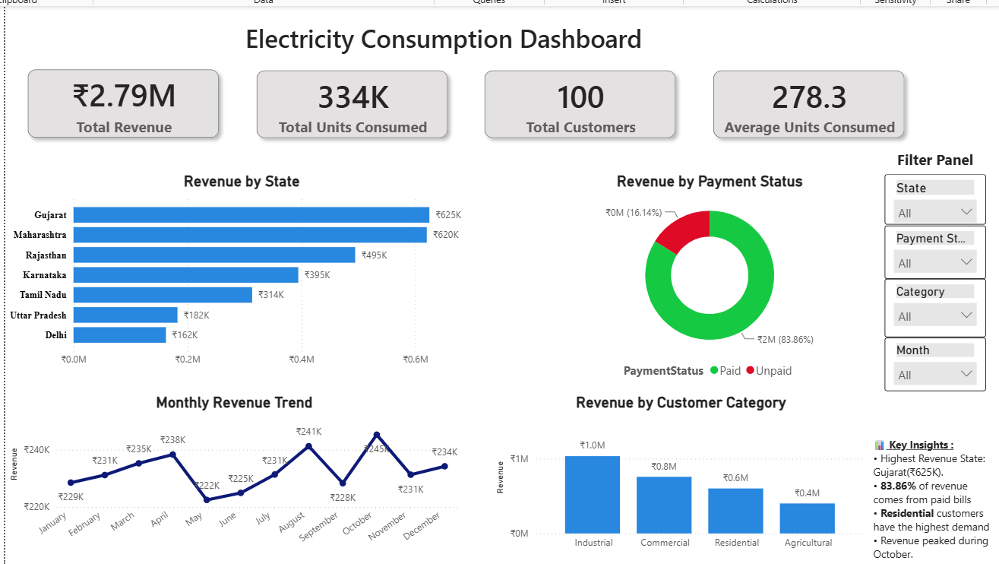
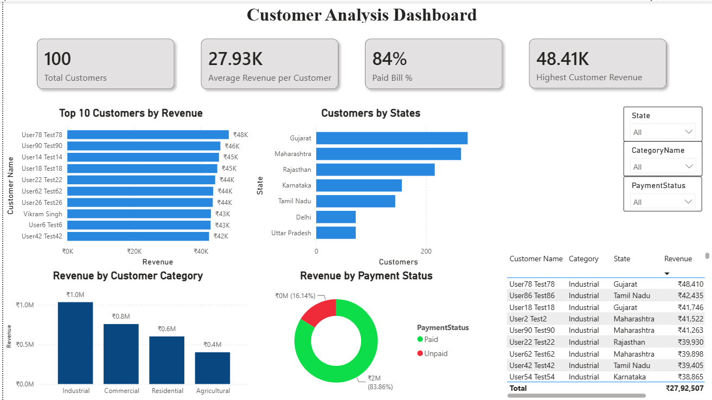
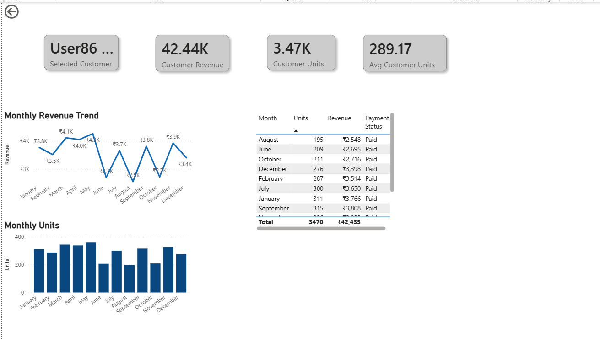
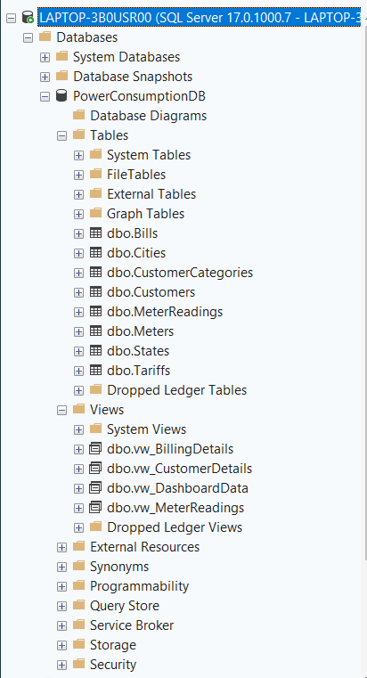
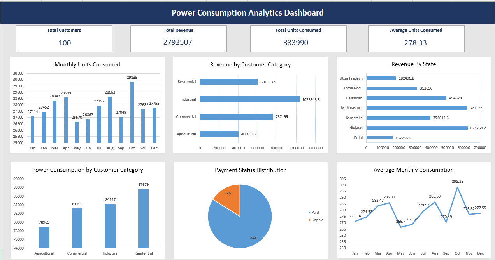

# Power Consumption Analytics Dashboard


## Project Overview


The *Power Consumption Analytics Dashboard* is a data analytics and business intelligence project developed to analyze electricity consumption, customer behavior, billing, revenue, and geographic patterns.


The project uses *SQL Server* for database management and analysis, *Excel* for supporting data analysis, and *Power BI* for interactive dashboard development and visualization.


## Objective


* Build and manage a structured electricity consumption database.

* Perform data preparation, validation, and analysis using SQL.

* Analyze consumption, customers, billing, and revenue using Excel.

* Develop an interactive Power BI dashboard for business-oriented insights.

* Enable analysis from high-level KPIs to customer-level details.


## Technology Stack


* *SQL Server*

* *SQL Server Management Studio (SSMS)*

* *Microsoft Excel*

* *Power BI*

* *DAX*


## Dataset \& Database


The project database is named *PowerConsumptionDB*.


The database contains structured information related to:


* Customers

* Customer Categories

* Meters

* Meter Readings

* Tariffs

* Bills

* States

* Cities


#### Dataset Summary


| Metric              | Value |

| ------------------- | ----: |

| Customers           |   100 |

| Meters              |   100 |

| Meter Readings      | 1,200 |

| Bills               | 1,200 |

| States              |     8 |

| Cities              |    18 |

| Customer Categories |     4 |


Customer categories include *Residential, Commercial, Industrial, and Agricultural*.


## SQL Analysis


SQL Server was used for database creation, data management, validation, and analytical processing.


Key SQL work includes:


* Database and table creation

* Data population and validation

* Customer and meter analysis

* Consumption analysis

* Revenue and billing analysis

* Geographic analysis

* Analytical SQL queries

* Views

* Stored procedures

* Dashboard data preparation through `vw\_DashboardData`


## Excel Analysis


Microsoft Excel was used for supporting analysis and validation.


The workbook contains three main sheets:


* *Dashboard*

* *Pivot Tables*

* *Raw\_Data*


Excel analysis includes:


* KPI calculations

* Pivot Tables

* Pivot Charts

* Data summarization

* Interactive analysis and filtering


## Power BI Dashboard


The final Power BI report contains three pages:


#### 1. Page 1


Provides an overall view of the electricity consumption and revenue data through key performance indicators and visual analysis.


#### 2. Customer Analysis


Provides customer-focused KPIs and visual analysis of customer consumption and billing-related information.


#### 3. Customer Details


Provides detailed customer-level information for deeper analysis.


## Key Dashboard Metrics


| KPI                    |         Value |

| ---------------------- | ------------: |

| Total Customers        |           100 |

| Total Revenue          | ₹2,792,507.20 |

| Total Units Consumed   |       333,990 |

| Average Units Consumed |        278.33 |


## Key Insights


* The analysis covers *100 unique customers and 100 meters*.

* Total recorded electricity consumption is *333,990 units*.

* Total analyzed revenue is approximately *₹2.79 million*.

* Revenue can be analyzed across different *states and customer categories*.

* Payment-status analysis provides visibility into billing/payment distribution.

* Monthly revenue analysis helps identify revenue patterns over time.

* Customer-focused dashboard pages allow analysis from aggregate KPIs to individual customer details.


## Dashboard Screenshots


#### Executive Dashboard





#### Customer Analysis





#### Customer Details





#### SQL Database





#### Excel Analysis





## Project Structure


```text

Power Consumption Analytics Dashboard

│

├── 01\_Database

│   ├── SQL Scripts

│   ├── Analytics Queries

│   ├── Views

│   └── Database Backup

│

├── 02\_Data

│   ├── Raw Data

│   ├── Clean Data

│   └── Generated Data

│

├── 03\_Excel

│   └── Power\_Consumption\_Analytics.xlsx

│

├── 04\_Power BI

│   └── Power Consumption Project PowerBI.pbix

│

├── 05\_Documentation

│

├── 06\_Images

│   ├── 01\_Dashboard\_Overview.png

│   ├── 02\_Customer\_Analysis.png

│   ├── 03\_Customer\_Details.png

│   ├── 04\_SQL\_Database.png

│   └── 05\_Excel\_Analysis.png

│

└── README.md

```


## Skills Demonstrated


* SQL

* Relational Database Management

* Data Validation

* Data Analysis

* Excel

* Pivot Tables \& Pivot Charts

* Power BI

* DAX

* Data Visualization

* Dashboard Development

* Business Intelligence


## Project Outcome


The project demonstrates an end-to-end analytics workflow, starting from structured data management and SQL analysis, followed by Excel-based analysis and validation, and culminating in an interactive Power BI dashboard for consumption, customer, revenue, and billing analysis.


